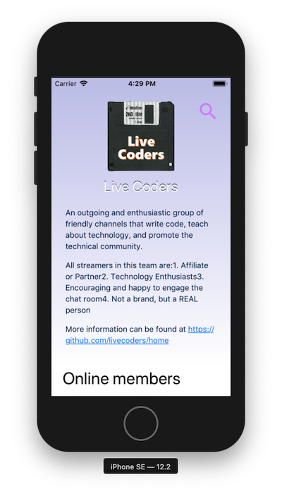
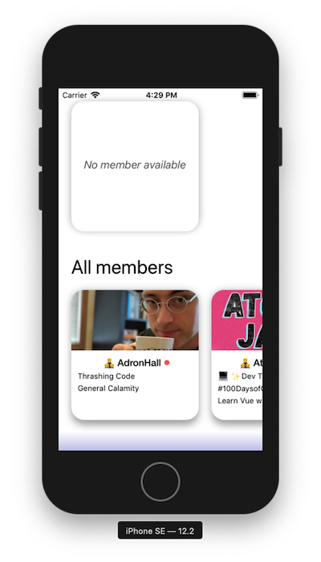
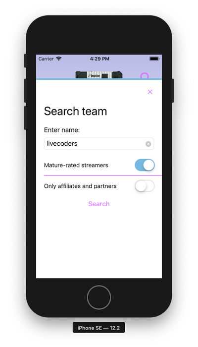

# Twitebo - Twtich Teams Browser
> Uses the Twitch API to get information from a team and it's members. It also allows to watch an online team's streamer.

## Prerequirements
- Xcode 10.2+
- Swift 5
- swiftlint
- swiftformat
- Twitch Developer API Client Id

## How it looks

## Contributing

This is a time-by-time sparetime project for myself. That means, no contribution is necessary.

## Authors

Just me, [Tobi]([https://tscholze.github.io).

## Thanks to

- Search / Close icon: [Google Material Design](https://materialdesignicons.com/)

## License

This project is licensed under the MIT License - see the [LICENSE](LICENSE.md) file for details.
Dependencies or assets maybe licensed differently.